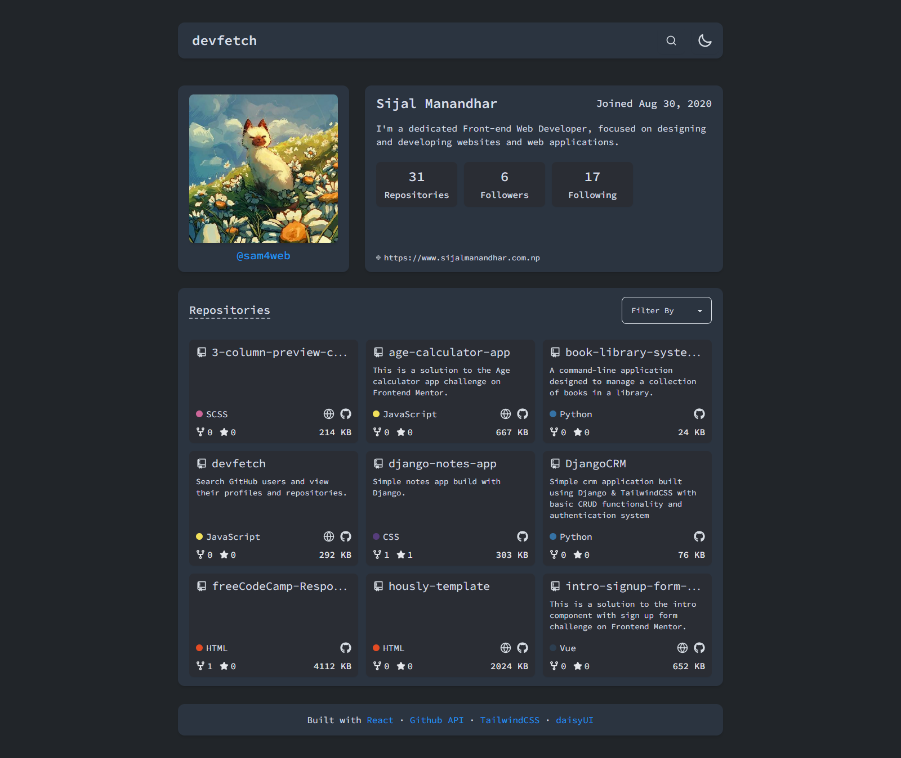

# DevFetch

DevFetch lets you search GitHub users and view their profiles and repositories. It is a simple web application built with React, TailwindCSS, and Zustand for state management. It allows you to search for GitHub users and view their details and repositories.

## Features

- **Search GitHub Users**: Easily find GitHub users by their username.
- **View User Details**: See detailed information about GitHub users, including their profile and repositories.
- **Sort Repositories**: Organize repositories based on stars, size & forks.
- **Theme Toggle**: Switch between light and dark themes for a better viewing experience.

## Usage

- Use the search bar to find GitHub users by their username.
- Click on a user from the search results to view their profile and repositories.
- Sort repositories based on different criteria.
- Toggle between light and dark themes using the theme switcher.

## Technologies Used

- **React**: For building the user interface.
- **TailwindCSS**: For styling the application.
- **DaisyUI**: For additional UI components.
- **Zustand**: For managing the application state.

## Links

- Source Code: [GitHub Repository](https://github.com/sam4web/devfetch/)
- Live Demo: [DevFetch Live](https://projectdevfetch.netlify.app/)

## Screenshot

